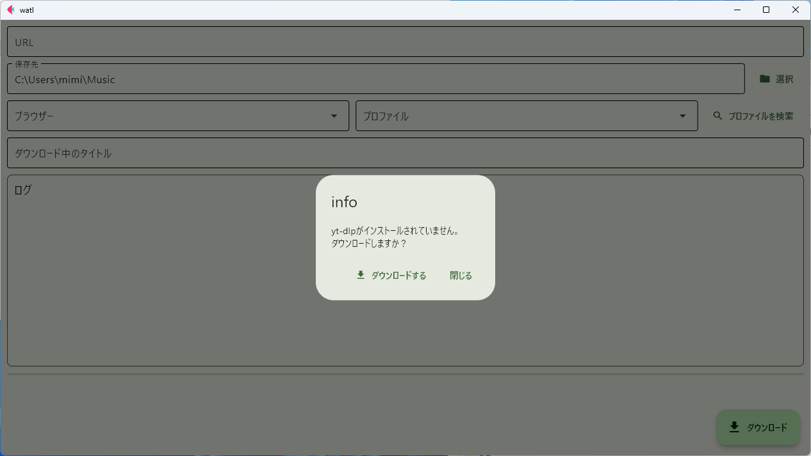
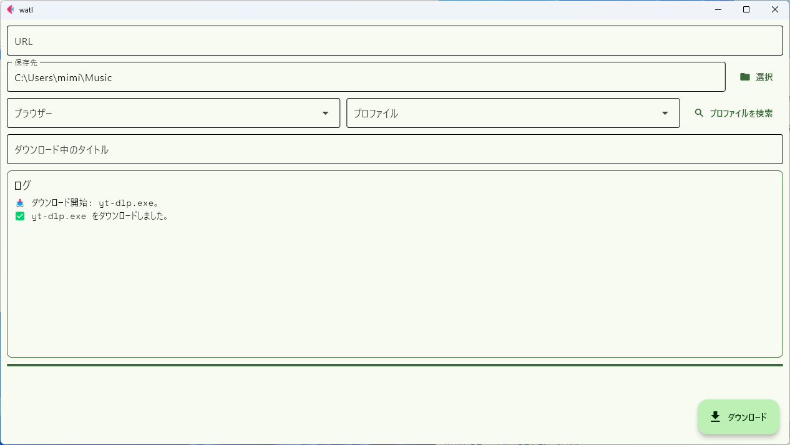

# watl

## about

watlはシンプルな音楽ダウンロードに特化したyt-dlpのGUIフロントエンドです。  
現在開発中ですが、基本的な機能を実装済みです。

## 機能

- mp3ダウンロード
- サムネイルのクロッピング
- ブラウザーからのCookie読み込み
- ブラウザーのプロファイル検索
- yt-dlpの自動ダウンロード(Win,Linuxのみ)

## セットアップ

> [!NOTE]  
> Windows向けのビルドのみを配布しています。  
> mac,Linuxはご自身でビルドしてください。

### zipのダウンロード
[Release](https://github.com/merorin-2929/watl/release/latest/)から.zipファイルをダウンロードしてください。  
`watl/watl.exe`の形になるように展開してください。

### ffmpegの配置
システムにffmpegがインストールされていない場合はこの手順を実行してください。  
[BtbN/FFmpeg-Builds](https://github.com/BtbN/FFmpeg-Builds/releases/tag/latest)から`ffmpeg-master-latest-win64-gpl.zip`をダウンロードし、  
binの中にある`ffmpeg.exe`,`ffprobe.exe`を`watl.exe`と同じ場所に配置してください。

### 実行
`watl.exe`をダブルクリックで起動します。  
起動時、`yt-dlp`の有無をチェックし、もしない場合は画像のようなダイアログがでます。



ダウンロードボタンをクリックするとOSに合わせてyt-dlpの実行ファイルがダウンロードされます。



> [!NOTE]  
> この機能はWindows,Linuxでのみ利用可能です。

## Firefox, Floorpのプロファイル検索

WindowsではChromeやChromiumベースのブラウザからcookieを読み込むことができません。  
Firefoxは`--cookies-from-browser firefox`で読み込めますがFloorpはこれだけでは読み込めません。

そのためwatlではプロファイル検索機能を実装し、プロファイルのパスを渡してcookieを読み込ませるといったことが簡単に行えるようにしています。

対応しているのはFirefox,Floorpのみです。

## エラーでダウンロードできない場合

yt-dlpの仕様変更により一部サイトからのダウンロードには、`yt-dlp-ejs`及び`deno`が必要になっています。  
pipを使用して、`yt-dlp-ejs`をインストールしてください。

```bash
pip install yt-dlp-ejs
```

その後、システムにdenoをインストールしてください。  
インストール方法に関しては[公式サイト](https://deno.com)をご確認ください。

## 更新履歴

### v0.0.2 (2025-11-27)
- **機能実装**  
    - URLからサービス・プレイリストを判別し、ダウンロードオプションを変更するように
    - メタデータのパースを行いトラック番号などを埋め込むように(YTMusic限定)

- **バグ修正**  
    - macOSでfletのファイルピッカーが動作しない為、fletのバージョンを下げた(`0.28.3`→`0.28.2`)
    - subprocessのCREATE_NO_WINDOWフラグをWindows以外で使用しないように

### v0.0.1 (2025-11-07)
最初のリリース。  
基本的な機能の実装が完了しました。